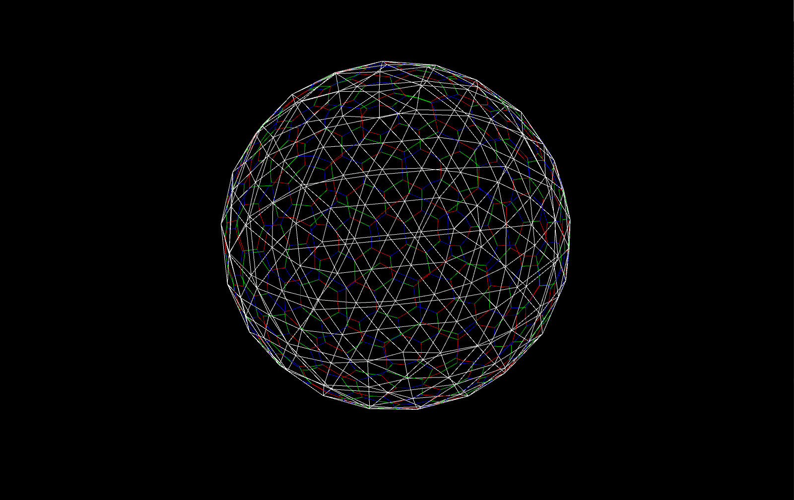
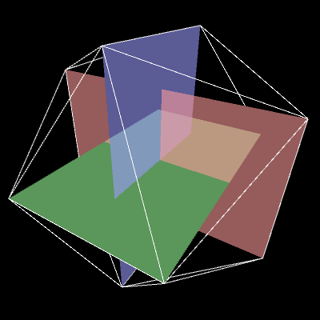
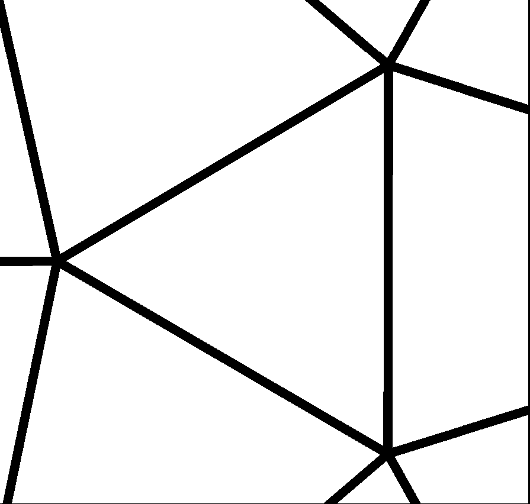

# Daisyworld
A 3D implementation of Andrew Watson's Daisyworld sim in Processing (WORK IN PROGRESS).
 
|  |
| :-:|
| _An icosphere with recursion depth of 3._ |

To build an icosphere, we first start with a icosahedron. The basic icosahedron can be constructed quite elegantly by arranging three rectangles of size 1 X phi. These 12 points serve as our starting vertices. Connecting these vertices yeilds 20 triangular faces.

In order to increase the density of the base icosahedron, we can subdivide each triangle into 4 smaller triangles, as shown below.

